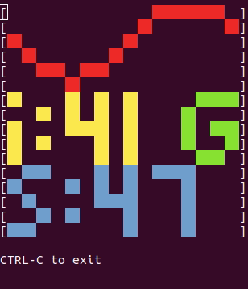
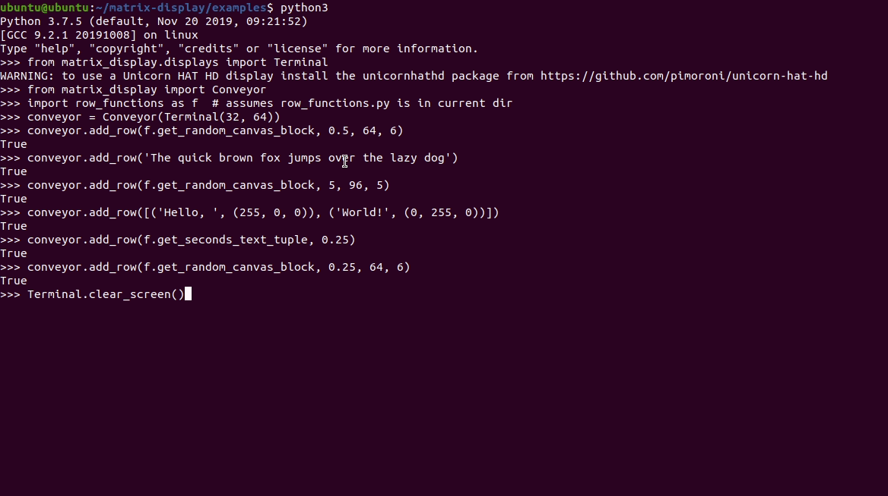

# LED Display Row Manager

Prints rows of text or pixel data on a matrix display. Long rows are scrolled.

A display row can show static content or poll a custom function for dynamic
content.

The [default font](src/matrix_display/font_5.py) aims to fit as much text as
possible on a small display.

# To Install
 
On an Ubuntu OS ([Creating an Ubuntu OS SD card for a Raspberry Pi](#creating-an-ubuntu-os-sd-card-for-a-raspberry-pi)):

```shell script
# Get this project 
git clone https://github.com/6871/matrix-display
cd matrix-display

# Ensure required software installed
sudo apt install --yes python3
sudo apt install --yes python3-pip
pip3 install setuptools

# Build the matrix_display package (.whl file)
python3 setup.py bdist_wheel

# Install package; sudo as 3rd-party display software must often run as root
sudo pip3 install dist/matrix_display-1.0.0-py3-none-any.whl
```

# To Use

The following examples show how to use the installed ```matrix_display```
package.

## Terminal Display

This example uses the [Terminal](src/matrix_display/displays/terminal.py)
display manager class to output content on a simulated LED display:

* [examples/display_terminal.py](examples/display_terminal.py)
  * Imports: [examples/row_functions.py](examples/row_functions.py)

Run with:

```
sudo python3 examples/display_terminal.py
```

Example output:



> RGB colours become red, green, blue, cyan, magenta, yellow, black or white 

## Unicorn HAT HD LED Display

This example uses the
[UnicornHATHD](src/matrix_display/displays/unicornhathd.py) display manager
class to output content on a
[Unicorn HAT HD](https://github.com/pimoroni/unicorn-hat-hd) LED display:

* [examples/display_unicornhathd.py](examples/display_unicornhathd.py)
  * Imports: [examples/row_functions.py](examples/row_functions.py)

Ensure [Unicorn HAT HD](https://github.com/pimoroni/unicorn-hat-hd)
dependencies are installed:

```shell script
sudo apt install --yes python3-pip
sudo apt install --yes python3-numpy  # required by unicornhathd package
sudo pip3 install unicornhathd
```

Run the example with:

```shell script
sudo python3 examples/display_unicornhathd.py
```

# API Summary

See the above examples for reference; they use this pattern:

1. Choose ([or create](#adding-display-drivers)) a display driver class; it
   must be a [Display](src/matrix_display/displays/display.py) sub-class
2. Create a display object from the chosen class
3. Create a [Conveyor](src/matrix_display/conveyor.py) object, pass the
   display object to its constructor
4. Add display content with the [Conveyor](src/matrix_display/conveyor.py)
   object's ```add_row``` method
5. Show the display content by calling the
   [Conveyor](src/matrix_display/conveyor.py) object's ```play``` method

[Conveyor](src/matrix_display/conveyor.py) constructor parameters:

Parameter    | Description
---          | ---
display      | A display driver object; its class must sub-class [Display](src/matrix_display/displays/display.py)
scroll_delay | Optional; scroll speed refresh in seconds; e.g. scroll_delay=0.03

A [Conveyor](src/matrix_display/conveyor.py) object's ```add_row``` method can
append these content types to a display:

Type                                                        | Description                                     | Example
---                                                         | ---                                             | ---
```string```                                                | Static text                                     | ```'Hello, World!'```
```tuple```                                                 | Tuple with text and RGB colour tuple            | ```('Hello, World!', (255, 255, 0))```
```list```                                                  | A list of the above tuples                      | ```[('R', (255, 0, 0)), ('G', (0, 255, 0))]```
[```matrix_display.Canvas```](src/matrix_display/canvas.py) | A [Canvas](src/matrix_display/canvas.py) object | ```get_sine_wave_canvas``` and ```get_random_canvas_block``` in [examples/row_functions.py](examples/row_functions.py) 
```function```                                              | A function returning a supported type           | [examples/row_functions.py](examples/row_functions.py) 

The ```add_row``` method returns ```False``` if the content does not fit; it
accepts the following parameters:
 
Parameter              | Description
---                    | ---
```content```          | The row's content; see table above for supported content types
```reload_wait_time``` | Optional; minimum seconds before content function is re-run
*args                  | Optional; positional parameters for content function, if required
**kwargs               | Optional; keyword parameters for content function, if required

Some RGB colour tuples are defined in
[matrix_display.rgb_colours](src/matrix_display/rgb_colours.py); they can be
accessed as follows:

```
$ python3
>>> from matrix_display import rgb_colours as rgb
>>> rgb.red
(255, 0, 0)
>>> rgb.teal
(0, 128, 128)
```

# Adding Display Drivers

The ```matrix_display``` package can be extended to drive other displays with
3rd party software libraries.

For example, to drive a display with the following library:

* https://github.com/hzeller/rpi-rgb-led-matrix

## 1. Install the software

```shell script
git clone https://github.com/hzeller/rpi-rgb-led-matrix

sudo apt install --yes libgraphicsmagick++-dev
sudo apt install --yes libwebp-dev
sudo apt install --yes make
sudo apt install --yes g++
sudo apt install --yes python3-pillow

cd rpi-rgb-led-matrix/bindings/python
make build-python PYTHON=$(which python3)
sudo make install-python PYTHON=$(which python3)
```

## 2. Create a display driver class

Extend class
[matrix_display.displays.Display](src/matrix_display/displays/display.py) to
create a new driver class that calls the 3rd party software library.

Use the ```__init__``` method for setup, the ```set_pixel``` method to update
display buffer pixels and the ```draw``` method to show the current pixel
buffer on the display:

```shell script
cat <<EOF > generic.py
#!/usr/bin/env python3
from matrix_display.displays import Display
from rgbmatrix import RGBMatrix, RGBMatrixOptions  # 3rd-party software


class Generic(Display):
    # Class variables for the 3rd-party software
    options = RGBMatrixOptions()
    pixels_now = None
    pixels_next = None

    def __init__(self, row_count, col_count, brightness=50,
                 pixel_mapper_config='Rotate:0'):
        # Notify parent of display size
        super().__init__(row_count, col_count)

        # Configure 3rd-party software
        self.options.rows = row_count
        self.options.cols = col_count
        self.options.brightness = brightness
        self.options.pixel_mapper_config = pixel_mapper_config
        self.pixels_now = RGBMatrix(options=self.options)
        self.pixels_next = self.pixels_now.CreateFrameCanvas()

    # noinspection PyMethodMayBeStatic
    def set_pixel(self, x, y, r, g, b):
        # Map set_pixel method to 3rd-party software's equivalent
        self.pixels_next.SetPixel(y, x, r, g, b)

    # noinspection PyMethodMayBeStatic
    def draw(self):
        # Map draw method to 3rd-party software's equivalent
        self.pixels_next = self.pixels_now.SwapOnVSync(self.pixels_next)
EOF
```

## 3. Use the driver class

Output to a 32 row by 64 column display
([Connecting LED Displays](#connecting-led-displays)) using 25% brightness and
180 degree rotation:
```shell script
sudo python3
```

```python
from generic import Generic  # assumes above generic.py file is in current dir
from matrix_display import Conveyor
import row_functions as f  # assumes row_functions.py is in current dir

conveyor = Conveyor(Generic(32, 64, 25, 'Rotate:180'))
conveyor.add_row(f.get_random_canvas_block, 0.5, 64, 6)
conveyor.add_row('The quick brown fox jumps over the lazy dog')
conveyor.add_row(f.get_random_canvas_block, 5, 96, 5)
conveyor.add_row([('Hello, ', (255, 0, 0)), ('World!', (0, 255, 0))])
conveyor.add_row(f.get_seconds_text_tuple, 0.25)
conveyor.add_row(f.get_random_canvas_block, 0.25, 64, 6)
conveyor.play()
```

The display driver can be switched from Generic to Terminal to capture output: 



> The Terminal display driver interprets most random pixel colours as white

# Appendices

## Creating an Ubuntu OS SD card for a Raspberry Pi

1. Download the OS image: https://ubuntu.com/download/raspberry-pi

2. Insert the SD card and identify the SD card device; ```lsblk``` can be used
for this

3. For the write operation to work as expected, ```umount``` any sub-devices;
for example, if using ```/dev/sda``` it may have child mounts```/dev/sda1```
and ```/dev/sda2```, in which case run: ```umount /dev/sda2``` and
```umount /dev/sda1```

4. Run the following to write the downloaded OS to the SD card:

```shell script
# Set target_device to your SD card device (e.g.: target_device=/dev/sda)
target_device=
```
```shell script
# Verify target_device is the target SD card
lsblk "${target_device}"
```
```shell script
# Ensure architecture is correct (here arm64 raspi3) and write it to the card
xzcat ubuntu-19.10.1-preinstalled-server-arm64+raspi3.img.xz \
  | sudo dd of="${target_device}" bs=4M status=progress
```
```shell script
# Eject device
sudo eject "${target_device}"
```

The Raspberry Pi can now be booted from the SD card.

## Connecting LED Displays

This is one variant of pin mapping to connect a 32 row, 64 column LED matrix
display to a Raspberry Pi's
[GPIO](https://www.raspberrypi.org/documentation/usage/gpio/) pins:

```
Mapping LED Matrix JIN pins to Raspberry Pi GPIO pins
                                                         Raspberry
        LED JIN Pins            for clarity             Pi GPIO pins
        +-----+-----+           only 1 link             +----+----+
  23 ---| R1  |  G1 |--- 13     is shown        3.3V ---|  1 |  2 |--- 5V
        +-----+-----+                                   +----+----+
  26 ---| B1  | GND |--- 6                              |  3 |  4 |--- 5V
        +-----+-----+                                   +----+----+
  24 ---| R2  |  G2 |--- 21                             |  5 |  6 |--- GND
        +-----+-----+                                   +----+----+
  19 ---| B2  | GND |---               +----------------|  7 |  8 |
        +-----+-----+                  |                +----+----+
  15 ---|  A  |  B  |--- 16            |         GND ---|  9 | 10 |
        +-----+-----+                  |                +----+----+
  18 ---|  C  |  D  |--- 22            |                    ...    
        +-----+-----+                  |                +----+----+
  11 ---| CLK | LAT |--- 7 ------------+                | 33 | 34 |--- GND
        +-----+-----+                                   +----+----+
  12 ---| OE  | GND |---                                | 35 | 36 |
        +-----+-----+                                   +----+----+
   |                     |                              | 37 | 38 |
    ---- Pi GPIO Pin ----                               +----+----+
                                                 GND ---| 39 | 40 |
LAT (latch) may be called STB (strobe)                  +----+----+
```
